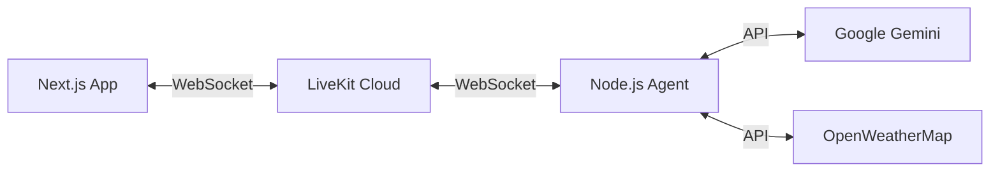

# 🌤️ Voice Weather Assistant

A real-time voice-activated weather assistant built with **Next.js**, **LiveKit**, and **Google Gemini**.

## 🚀 How It Works

1.  **Voice Input**: The user speaks into the microphone on the Next.js client.
2.  **Real-time Streaming**: Audio is streamed via WebSockets (LiveKit) to a backend agent.
3.  **AI Processing**:
    *   **Gemini 2.0 Flash** processes the audio input directly (Multimodal).
    *   It understands the intent (e.g., "What's the weather in Mumbai?").
4.  **Tool Calling**: The agent calls the OpenWeatherMap API to fetch real-time data.
5.  **Voice Response**: The agent generates a natural voice response and streams it back to the client.

## 🛠️ Tech Stack

*   **Frontend**: Next.js 15, TailwindCSS, LiveKit React Components
*   **Backend Agent**: Node.js, LiveKit Agents Framework
*   **AI Model**: Google Gemini 2.0 Flash (Multimodal)
*   **Weather Data**: OpenWeatherMap API
*   **Real-time Infra**: LiveKit Cloud

## 🏗️ Architecture



## 🏁 Getting Started

### Prerequisites

*   **LiveKit Cloud** account (for real-time audio/video)
*   **Google AI Studio** key (for Gemini)
*   **OpenWeatherMap** key (for weather data)

### 1. Clone the Repository

```bash
git clone https://github.com/harshkandera/voice-weather.git
cd voice-weather
```

### 2. Environment Setup

Create a `.env.local` file in the client directory:

```bash
LIVEKIT_API_KEY=your_key
LIVEKIT_API_SECRET=your_secret
LIVEKIT_URL=your_livekit_url
```

### 3. Run the Client

```bash
npm install
npm run dev
```

Open [http://localhost:3000](http://localhost:3000).

### 4. Run the Agent (Server)

*Note: The server code is located in the `server/` directory.*

Create a `.env` file in the server directory:

```bash
LIVEKIT_URL=your_livekit_url
LIVEKIT_API_KEY=your_key
LIVEKIT_API_SECRET=your_secret
OPENWEATHER_API_KEY=your_weather_key
GEMINI_API_KEY=your_gemini_key
```

Then run the worker:

```bash
cd server
pnpm install
pnpm dev
```

## 🌟 Features

*   **Hands-free Interaction**: Just speak to ask about the weather.
*   **Real-time Latency**: Ultra-low latency response using Gemini 2.0 Flash.
*   **Live Transcriptions**: See what the agent hears and says.
*   **Visual Feedback**: Dynamic UI states for listening/speaking.
